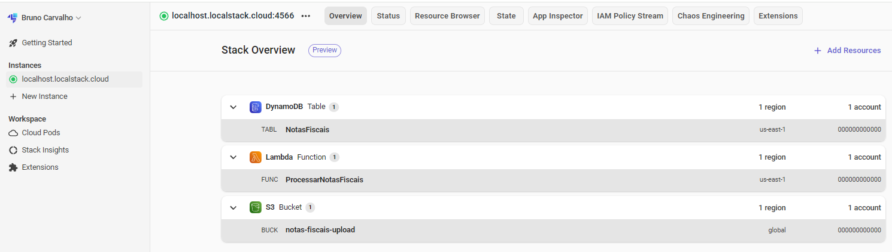
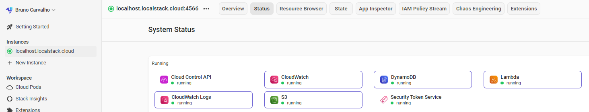
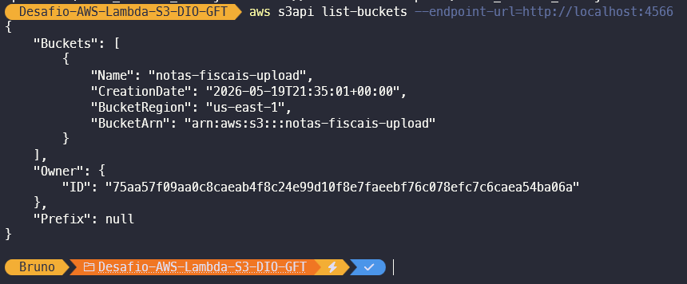
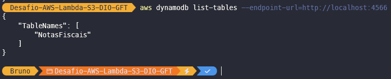
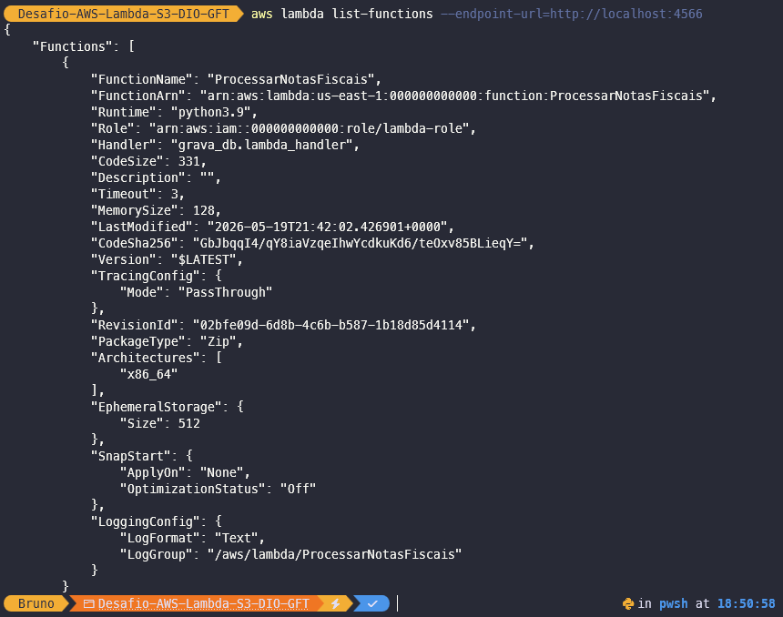
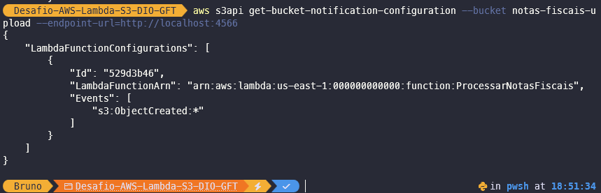
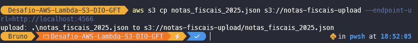

# Desafio AWS Lambda Function e S3 - DIO & GFT

## Sobre o Projeto

Este projeto foi desenvolvido durante o bootcamp **GFT - Fundamentos de Cloud com AWS**, realizado pela DIO.

O objetivo foi automatizar o processamento de arquivos JSON utilizando **AWS Lambda** e **Amazon S3**, com os dados sendo registrados no **DynamoDB**. Para simular os serviços AWS localmente, foi utilizado o **LocalStack**.

---

## Tecnologias Utilizadas

- AWS Lambda
- Amazon S3
- Amazon DynamoDB
- LocalStack
- AWS CLI
- Docker Desktop
- Python
- GitHub

---

## Conceitos Estudados

- Automação de tarefas com AWS Lambda
- Upload e processamento de arquivos no Amazon S3
- Integração entre S3 e Lambda via trigger
- Criação de tabelas no DynamoDB
- Simulação local da AWS com LocalStack
- Comandos AWS CLI

---

## Fluxo da Aplicação

```text
Upload de arquivo JSON no S3
        ↓
S3 aciona automaticamente a função Lambda
        ↓
Lambda processa os dados do arquivo
        ↓
Dados são registrados no DynamoDB
```

---

## Estrutura do Projeto

```text
Desafio-AWS-Lambda-S3-DIO-GFT/
│
├── images/
├── grava_db.py
├── notification_roles.json
├── notas_fiscais_2025.json
├── comandos-importantes.txt
└── README.md
```

---

## Capturas de Tela

### Visão Geral da Infraestrutura no LocalStack



---

### Health Check do LocalStack



---

### Bucket S3 Criado



---

### Tabela DynamoDB Criada



---

### Função Lambda Criada



---

### Trigger S3 Configurado



---

### Upload do Arquivo JSON



---

## Aprendizados

Durante este laboratório foi possível entender na prática como funciona a automação de tarefas em ambientes cloud, integrando S3, Lambda e DynamoDB. O uso do LocalStack permitiu simular toda a infraestrutura AWS localmente, sem custos.

---

## Créditos

Projeto desenvolvido durante o bootcamp **GFT - Fundamentos de Cloud com AWS**.

- [DIO](https://www.dio.me)
- [GFT](https://www.gft.com/br/pt)

**Especialista responsável pelo conteúdo:**
- [Alexsandro Lechner - LinkedIn](https://linkedin.com/in/alexsandrolechner)
- GitHub: [@alexsandrolechner](https://github.com/alexsandrolechner)

---

## Autor

**Bruno Carvalho**

[](https://www.linkedin.com/in/brunogacarvalho/)
